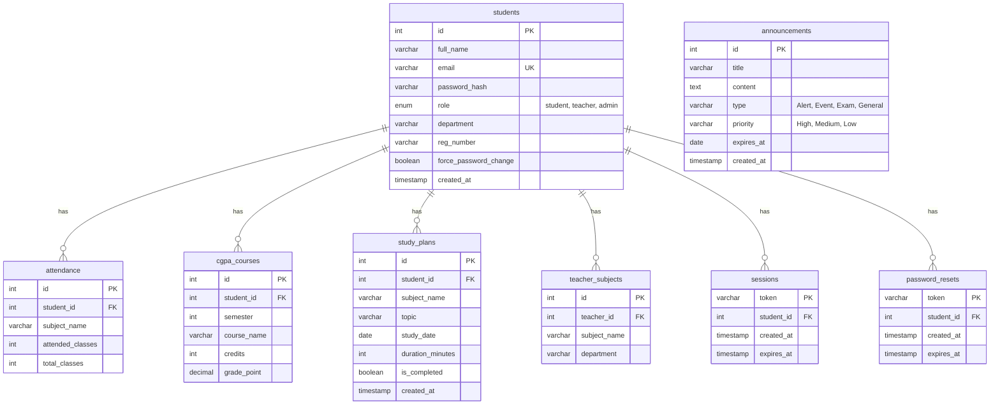

# CampusAI — Smart College Assistant | Complete Project Details

CampusAI is a comprehensive, role-based academic assistant web application designed to help **Students** manage their academic performance, **Teachers** track class attendance, and **Admins** manage campus-wide operations and communications.

This document serves as the single source of truth for the entire system, detailing the tech stack, file tree, database schema, role privileges, authentication, features, and setup instructions.

---

## 1. System Architecture & Tech Stack

CampusAI is built as a single-page application (SPA) frontend communicating with a modular REST API backend and a persistent MySQL relational database.

| Layer | Component | Version | Purpose & Configuration |
| :--- | :--- | :--- | :--- |
| **Frontend UI** | React | 18.3.1 | Core component-based interface framework. |
| **Frontend Build** | Vite | 5.2.11 | Dev server, hot module reloading, and production bundling. |
| **Routing** | React Router DOM | 6.23.1 | Declarative client-side routing (`/login`, `/dashboard`, `/teacher`, `/admin`). |
| **Icons** | Lucide React | 0.395.0 | High-quality SVG icon components for buttons and navigation items. |
| **Styling** | Vanilla CSS | — | Custom glassmorphism, responsive grids, and animations (`index.css`). |
| **Backend API** | FastAPI | ≥0.111.0 | Fast, type-safe Python asynchronous web framework for REST endpoints. |
| **Server Runner** | Uvicorn | ≥0.30.1 | ASGI web server to run the FastAPI application. |
| **Database** | MySQL Server | 8.x | Relational storage for profiles, grades, attendance, and sessions. |
| **DB Connector** | mysql-connector-python | ≥8.0.33 | Pure-Python MySQL client to execute queries and manage connections. |
| **Security** | bcrypt | ≥4.1.0 | Hashing and verification algorithm for secure password storage. |
| **Validation** | Pydantic | ≥2.7.4 | Body request and response models with runtime type enforcement. |
| **AI Integration** | Google Gemini | 2.5 Flash | v1beta API used for chat logic (with local rule-based fallback). |

---

## 2. Directory & File Structure

The project is structured logically into a backend API service and a frontend React application:

```
CAMPUS ASSISTANT/
│
├── backend/                             # Python FastAPI backend server
│   ├── .env                             # Environment variables (Credentials & Keys)
│   ├── requirements.txt                 # Python dependencies list
│   ├── schema.sql                       # Database schema reference script
│   ├── database.py                      # DB connection pools, tables, and migrations
│   ├── dependencies.py                  # API dependencies (Session token auth guards)
│   ├── auth.py                          # Auth helpers (Hashing, password checks)
│   ├── main.py                          # Backend entrypoint (CORS & routers setup)
│   └── routers/                         # Modular route groups
│       ├── auth_router.py               # Login, register, password resets, and changes
│       ├── student.py                   # Student attendance, CGPA, chatbot, performance
│       ├── teacher.py                   # Teacher view student metrics, bulk mark attendance
│       └── admin.py                     # Admin statistics, roster, announcement edits, teachers
│
└── frontend/                            # React + Vite frontend application
    ├── index.html                       # HTML root, Google Fonts (Outfit), and page title
    ├── package.json                     # Node script triggers and JS dependencies
    ├── vite.config.js                   # Vite React plugin setup
    └── src/
        ├── main.jsx                     # Renders the application into index.html
        ├── App.jsx                      # App root (Session state, router configuration)
        ├── index.css                    # Design token styles, animations, and glassmorphic cards
        ├── api.js                       # Centralized fetch wrapper (Injects Bearer tokens)
        └── pages/                       # Screen and component layouts
            ├── Login.jsx                # Multi-role single login form
            ├── Register.jsx             # Student registration form
            ├── ForgotPassword.jsx       # Reset token requester form
            ├── ResetPassword.jsx        # Reset password submitter form
            ├── ChangePassword.jsx       # Form for first-time password updates or settings
            │
            ├── student/                 # Student Workspace
            │   ├── StudentLayout.jsx    # Sidebar and navigation shell
            │   ├── StudentHome.jsx      # Metrics overview & active announcements
            │   ├── AttendanceTracker.jsx# Personal attendance logging & bunk insight
            │   ├── CgpaCalculator.jsx   # Accordion courses and Target CGPA simulator
            │   ├── Chatbot.jsx          # AI Chatbot widget with quick options
            │   ├── PerformancePredictor.jsx # What-if grade simulation & risk predictor
            │   ├── ResumeAnalyzer.jsx   # Role alignment matching & skill-gap analyzer
            │   ├── StudyPlanner.jsx     # Exam schedules auto-planner
            │   └── Profile.jsx          # Student details viewer
            │
            ├── teacher/                 # Teacher Workspace
            │   ├── TeacherLayout.jsx    # Sidebar container
            │   ├── TeacherHome.jsx      # Assigned subjects status and metrics
            │   ├── SubjectAttendance.jsx# Student list and Mark Today session modal
            │   ├── StudentOverview.jsx  # Student rosters filterable by low attendance
            │   └── AccountSettings.jsx  # View profile & password settings
            │
            └── admin/                   # Admin Workspace
                ├── AdminLayout.jsx      # Sidebar container
                ├── AdminHome.jsx        # Campus-wide statistics cards
                ├── StudentRoster.jsx    # Complete student table with filters & drawers
                ├── TeacherManagement.jsx# Manage teacher accounts and promote students
                ├── AnnouncementManager.jsx # Create, edit, delete bulletin announcements
                └── AccountSettings.jsx  # Password update form
```

---

## 3. Database Schema

The database `campus_ai` consists of 8 tables. Relationships are linked using foreign keys with `ON DELETE CASCADE` to maintain data integrity when user records are removed.



### Table Details

1. **`students`**: User registry holding identifiers, passwords, roles, and profiles.
2. **`attendance`**: Class attendance tracking for students.
3. **`cgpa_courses`**: Semesters 1–8 course registry containing credits and grades.
4. **`study_plans`**: Scheduled sessions generated manually or via the planner algorithm.
5. **`teacher_subjects`**: Maps teachers to the subjects they instruct.
6. **`sessions`**: Server-side active login tokens (expiring in 8 hours) to secure API calls.
7. **`password_resets`**: 1-hour secure tokens generated for forgotten password links.
8. **`announcements`**: Broadcast messages showing alerts, exams, or events, support auto-expiration.

---

## 4. User Roles & Privilege Matrix

System permissions are enforced **on both the frontend UI and server-side API dependencies**.

| Capabilities & Features | Student | Teacher | Admin |
| :--- | :---: | :---: | :---: |
| **Authentication Self-Registration** | ✅ | ❌ | ❌ |
| **Check Personal Stats Dashboard** | ✅ | ❌ | ❌ |
| **Track Personal Attendance (Self-Service)** | ✅ | ❌ | ❌ |
| **Calculate Grades & Semesters CGPA** | ✅ | ❌ | ❌ |
| **Converse with Gemini AI Assistant** | ✅ | ❌ | ❌ |
| **View Performance Risk & Simulations** | ✅ | ❌ | ❌ |
| **Upload and Scan Resumes** | ✅ | ❌ | ❌ |
| **Automate Study Calendars** | ✅ | ❌ | ❌ |
| **View Broadcast announcements** | ✅ | ✅ | ✅ |
| **View assigned subjects/courses** | ❌ | ✅ | ✅ |
| **View roster & attendance logs of taught subjects** | ❌ | ✅ | ✅ |
| **Mark daily student attendance logs** | ❌ | ✅ | ❌ |
| **Publish / Edit / Delete announcements** | ❌ | ❌ | ✅ |
| **View Campus-wide global statistics** | ❌ | ❌ | ✅ |
| **View complete student rosters** | ❌ | ❌ | ✅ |
| **Manage Teacher accounts (Create / Delete)** | ❌ | ❌ | ✅ |
| **Promote a Student to a Teacher role** | ❌ | ❌ | ✅ |
| **Assign subjects to Teachers** | ❌ | ❌ | ✅ |

---

## 5. Security & Session Lifecycle

### 5.1 Token-Based Sessions
Instead of storing user profiles directly in client browsers, CampusAI utilizes **Server-Side Signed Sessions**:
- **On Success Login**: The backend creates a unique UUID session token, stores it in the `sessions` table (with an 8-hour expiration), and returns it to the client.
- **Client Storage**: The browser stores the token string in `localStorage` (`localStorage.setItem('token', token)`).
- **Secure Calls**: Every request goes through `api.js`, injecting the token in header format: `Authorization: Bearer <token>`.
- **Backend Guard**: FastAPIs dependencies validate the session. If the token is invalid or expired, the API throws `401 Unauthorized`. The frontend intercepts this and redirects back to `/login`.

### 5.2 Registration Domain Filters
- Only institutional email addresses are permitted.
- **Students**: Validated against `ALLOWED_STUDENT_DOMAINS` (e.g. `sairamtap.edu.in`, `edu.in`).
- **Admins**: Validated against `ADMIN_EMAIL_DOMAIN` (configured in `.env`, e.g. `campus.edu`).

### 5.3 Password Management Flow
- **ForgotPassword**: Submits an email. A token is generated and recorded. Because SMTP is optional, the reset link is printed directly to the server logs for developer reference (or sent via SMTP if credentials are set).
- **ResetPassword**: Submits the token and the new password. Checks the token's validity, changes the password hash, and invalidates the token.
- **ForcePasswordChange**: Created teacher accounts require a change of the temporary password on the very first login.

---

## 6. Functional Modules Breakdown

### 6.1 Student Workspace

#### Home Dashboard
- Real-time stats widgets displaying cumulative CGPA, overall attendance percentage (color-coded status badges), and upcoming study sessions.
- Read-only feed listing all active broadcast announcements. A red notification badge is displayed in the sidebar when unread announcements exist.

#### Attendance Tracker
- Students log subjects, completed classes, and attended classes.
- Present/Absent shortcuts increment values dynamically.
- Shows class attendance status: **Safe** (green bar for $\geq 75\%$) or **Danger** (red bar for $< 75\%$).
- **Bunk Calculator**: Provides insights like *"You can bunk 2 more classes"* or *"You need to attend 4 more classes in a row to reach 75%"*.

#### CGPA Calculator
- Accordion sections organize courses by semesters (1 to 8).
- Course details include course name, credits, and grade point.
- **Target CGPA Simulator**: Allows input of a desired target CGPA. The calculator tells the student the exact SGPA average needed across remaining credits to achieve that target.

#### AI Chatbot
- A conversation interface that queries the student's context (name, department, grades, attendance status) and grounds the query context.
- Sends the prompt to Google Gemini 2.5 Flash.
- **Local Rule Engine**: If the Gemini API fails, a local keyword-matching engine uses the student's real database records to answer academic questions accurately.

#### Performance Predictor
- Analyzes cumulative grades and attendance logs to rank academic status (**Stable**, **Warning**, or **Critical**).
- Simulates next-semester SGPA and penalizes predicted grades if attendance falls below $75\%$.
- **What-If Sandbox**: Allows students to simulate grade points for courses to preview the final impact on CGPA.

#### Resume Analyzer
- Paste resume text or upload `.txt` files.
- Select target roles (e.g. *Frontend Developer*, *Data Scientist*).
- Calculates role alignment percentage, listing matched skills and skill gaps, and returns a tailored learning roadmap.

#### Study Planner
- **Auto-Scheduler**: Takes an exam start date and daily study hour limit, then calculates a priority-weighted schedule.
- prioritizes low-attendance subjects (1.5x weight weight multiplier) and credit weights to schedule more preparation sessions.

---

### 6.2 Teacher Workspace

#### TeacherHome
- Tracks assigned courses and enrolled student counts.
- Displays class health metrics (percentage of students currently holding $\geq 75\%$ attendance).

#### Subject Attendance Manager
- Selects from assigned subjects to load the student list.
- **Mark Today Session**: A bulk modal listing students with checkbox flags. Checking present and submitting increments overall held classes and attended values automatically.

#### Student Overview
- Combined roster showing all students in the teacher's subjects.
- Filter options show only students under $75\%$ attendance (At-Risk).
- Student grades (CGPA) are completely hidden from teachers to maintain grading privacy.

---

### 6.3 Admin Workspace

#### AdminHome & Metrics
- Campus statistics: total active student records, average campus CGPA, and average student attendance.

#### Student Roster
- Complete system student roster with search filters (by name, registration number) and academic risk classifications.
- Click on any row to open a details panel showing CGPA, subject attendance lists, and account age.
- **CSV Exporter**: Generates and downloads the current student table in CSV format.
- **Bulk Cleanup**: Support for select-all and bulk-delete operations (secured by a typed text validation).

#### Teacher Management
- **Add Teacher**: Sets full name, institutional email, department, and a temporary password (triggering `force_password_change`).
- **Subject Assignment**: Assigns multiple classes and subjects to teachers.
- **Promote Student**: Searches and promotes student profiles to teacher accounts, assigning their department and subjects.

#### Announcement Manager
- Publishes campus bulletins with priority (High, Medium, Low) and type (Alert, Event, Exam, General).
- Sets `expires_at` dates to hide announcements from feeds automatically.
- Allows editing existing announcement details.

---

## 7. Setup & Run Instructions

### Prerequisites
- Node.js (v18 or higher)
- Python (v3.10 or higher)
- MySQL Server (v8.0 or higher) on port 3306

---

### Step 1: Environment Configuration
Create a `.env` file in the `backend/` directory:

```ini
DB_HOST=localhost
DB_USER=root
DB_PASSWORD=your_mysql_password
DB_NAME=campus_ai
DB_PORT=3306

# API key for the Google Gemini Chatbot
GEMINI_API_KEY=your_gemini_api_key_here

# Initial Admin Seeding Credentials
ADMIN_EMAIL=admin@campus.edu
ADMIN_PASSWORD=secure_admin_password_123
ADMIN_EMAIL_DOMAIN=campus.edu

# Domain rules
ALLOWED_STUDENT_DOMAINS=edu,edu.in,sairamtap.edu.in
SESSION_EXPIRY_HOURS=8

# Allowed CORS client hosts
ALLOWED_ORIGINS=http://localhost:5173,http://127.0.0.1:5173

# Optional SMTP setup for logs/emails
SMTP_HOST=smtp.gmail.com
SMTP_PORT=587
SMTP_USER=noreply@campus.edu
SMTP_PASSWORD=smtp_app_password
SMTP_FROM=noreply@campus.edu
```

---

### Step 2: Running the Backend

Open a terminal at the project root and execute:

```powershell
# Navigate into the backend folder
cd backend

# Create a virtual environment
python -m venv .venv
# Activate virtual environment (Windows)
.venv\Scripts\Activate.ps1

# Install requirements
pip install -r requirements.txt

# Run the FastAPI server
uvicorn main:app --reload
```
*On server startup, `database.py` will auto-create the database `campus_ai`, all tables, run necessary column migrations, and seed the default admin account.*

---

### Step 3: Running the Frontend

Open a new terminal at the project root and execute:

```powershell
# Navigate into the frontend folder
cd frontend

# Install Node dependencies
npm install

# Start the Vite development server
npm run dev
```

The frontend app will launch at `http://localhost:5173`. 
The Swagger API documentation will be available at `http://localhost:8000/docs`.

---

## 8. Credentials for Testing
- **Seeded Admin**: `admin@campus.edu` / *(configured password in `.env`)*
- **Self-Registered Students**: Can be created directly on the `/register` page using email domains like `@sairamtap.edu.in` or ending in `.edu` / `.edu.in`.
- **Teachers**: Created through the Admin Workspace page (`/admin/teachers`).
